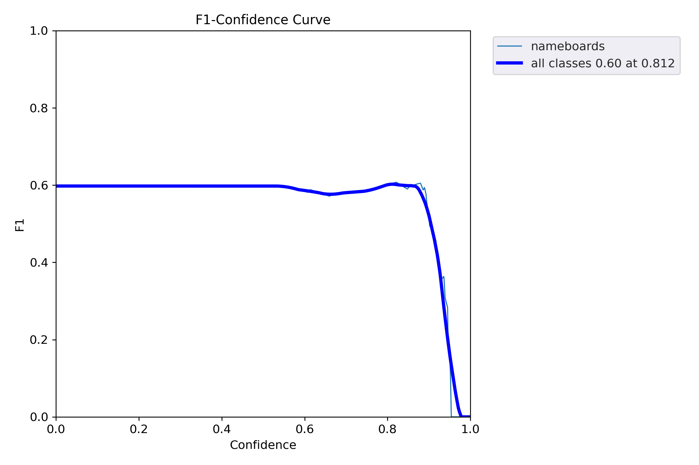
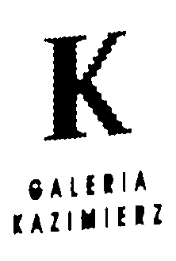
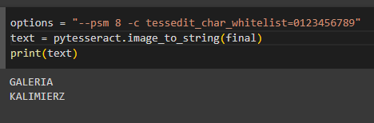

# Shop nameboard detection and recognition using in Yolov5 object detection model

Object detection of single or multiple objects and inferencing it on Google colab. Since Colab provides free GPUs such as Nvidia Tesla T4, we can instantly use these resources for training and testing the deep learning models. Here are the steps for implementing this model for detecting nameboards.

1. Create custom dataset of shop nameboards(~400) using webscraping and annotate them using tools such as Robogflow/ VGG image annotator or LabelImg.

2. Divide the dataset into train test format

3. Calculation of anchor boxes according to dataset

4. Zip the prepared data and upload it to Google Colab

5. Load the datset and train the model

6. Inference the model as the final step

### Step1:
Here the downloaded images are annotated using VGG/LabelImg/Roboflow annotator tool and are put usder the folder final_dataset.zip. As we annotate each images, we get the corresponding .txt file that has respective annotations. The number of classes required are mentioned in data.yaml file.

### Step2:
In this step the data into train, valid and test images. The dataset has 377 images and is split into 70%-20%-10% resepectively.

### Step3:
Anchor boxes are calculated as each image undergoas annotation using K-means clustering and saves it as a txt file.

### Step4:
Open Colab and mount the Google drive and start training the model. The model is trained for first 50 epochs with pretrained Yolov5L weights on MS COCO dataset and the custom weightfile is saved.Afterwards the model is again trained for next 75 epochs with finetuning and is cached. 

Inferencing: The trained weights can be inferenced on images, video mp4 files or streamed on YouTUbe video links using detect.py file. 

Here's the sample of object detection on single image file. 


### Evalutation: 
The metrics followed to evaluate the model are Precision, Recall, mAP and F1 score. 
Highest F1 score of 0.646 with mAP 0.418 (0.5-0.95) at confidence and IOU threshold of 0.5 was achieved on validation dataset.
The F1 score for the class stands at 0.6 at confidence threshold of 0.812. Below fig shows the F1-confidence threshold curve.


## OCR:
After detecting the nameboards on shops, we will extract the images in the bounding box using OCR library. First we crop the selected image by passing ```--save-crop``` argument while using ```detect.py```. Then install the required Tesseract library for OCR text recognition.

```
!sudo add-apt-repository ppa:alex-p/tesseract-ocr
!sudo apt-get update
!sudo apt install tesseract-ocr
!sudo apt install libtesseract-dev
!sudo pip install pytesseract
```
### Image preprocessing:
We load the cropped input image and convert it into grayscale and apply Otsu thresholding. Since we’ve inverted the binary threshold via the ```cv2.THRESH_BINARY_INV flag```, OCR text will be in white foreground, and some parts of the background will be removed.
```
# load the input image and convert it to grayscale
image = cv2.imread(args["image"])
gray = cv2.cvtColor(image, cv2.COLOR_BGR2GRAY)
# threshold the image using Otsu's thresholding method
thresh = cv2.threshold(gray, 0, 255,
	cv2.THRESH_BINARY_INV | cv2.THRESH_OTSU)[1]
cv2.imshow("Otsu", thresh)
```

Apply opening morphological operation (i.e, dilation followed by erosion) disconnects connected blobs and removes noise.

```
#apply an "opening" morphological operation to disconnect components
#in the image
kernel = cv2.getStructuringElement(cv2.MORPH_ELLIPSE, (7, 7))
opening = cv2.morphologyEx(dist, cv2.MORPH_OPEN, kernel)
cv2.imshow("Opening", opening)
```
Exrtract contours in a binary image means to find all the isolated foreground blobs.

```
#find contours in the opening image, then initialize the list of
#contours which belong to actual characters that we will be OCR'ing
cnts = cv2.findContours(opening.copy(), cv2.RETR_EXTERNAL,
	cv2.CHAIN_APPROX_SIMPLE)
cnts = imutils.grab_contours(cnts)
chars = []
#loop over the contours
for c in cnts:
	# compute the bounding box of the contour
	(x, y, w, h) = cv2.boundingRect(c)
	# check if contour is at least 35px wide and 100px tall, and if
	# so, consider the contour a digit
	if w >= 35 and h >= 100:
		chars.append(c)
  ```

After all contours ```cnts``` arde found, we need to determine which ones to discard and which to add to our list of characters. loop over the cnts, filtering out contours that aren’t at least 35 pixels wide and 100 pixels tall. Those that pass the test are added to the chars list.

```
#compute the convex hull of the characters
chars = np.vstack([chars[i] for i in range(0, len(chars))])
hull = cv2.convexHull(chars)
#allocate memory for the convex hull mask, draw the convex hull on
#the image, and then enlarge it via a dilation
mask = np.zeros(image.shape[:2], dtype="uint8")
cv2.drawContours(mask, [hull], -1, 255, -1)
mask = cv2.dilate(mask, None, iterations=2)
cv2.imshow("Mask", mask)
#take the bitwise of the opening image and the mask to reveal *just*
#the characters in the image
final = cv2.bitwise_and(opening, opening, mask=mask)
```

Call ```pytesseract``` library to implement OCR 

```
#OCR the input image using Tesseract
options = "--psm 8 -c tessedit_char_whitelist=0123456789"
text = pytesseract.image_to_string(final, config=options)
print(text)
#show the final output image
cv2.imshow("Final", final)
cv2.waitKey(0)
```
Below images show final image without background and text extraction using OCR.




